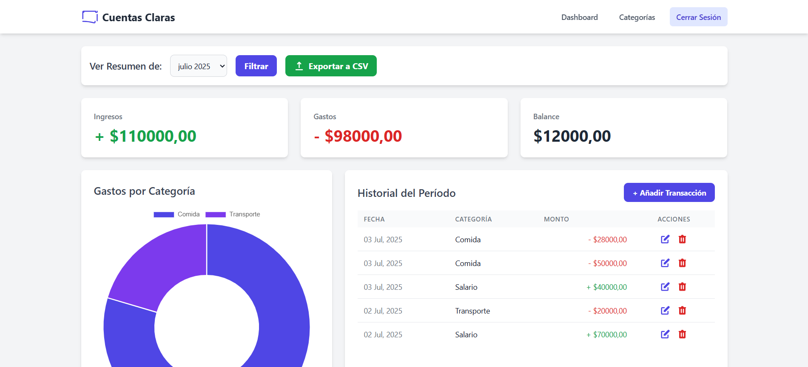
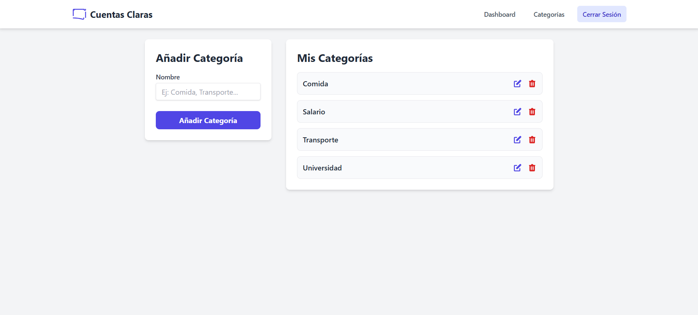

# Cuentas Claras - Aplicación de Seguimiento de Gastos


**Cuentas Claras** es una aplicación web full-stack desarrollada con Python y Django, diseñada para ofrecer a los usuarios una herramienta intuitiva y potente para el seguimiento de sus finanzas personales. Este proyecto demuestra habilidades clave en desarrollo backend, frontend y despliegue de aplicaciones en un entorno de producción.

---

## 🚀 Demo en Vivo

Puedes probar la aplicación en vivo sin necesidad de registrarte usando las siguientes credenciales:

**URL:** **[https://cuentas-claras-samep.onrender.com/](https://cuentas-claras-samep.onrender.com/)**

* **Usuario:** `demo`
* **Contraseña:** `demo1234`

---

## ✨ Características Principales

* **Autenticación de Usuarios:** Sistema completo de registro e inicio de sesión para que cada usuario gestione sus finanzas de forma privada y segura.
* **CRUD Completo para Transacciones:** Los usuarios pueden **C**rear, **L**eer, **A**ctualizar y **E**liminar (CRUD) sus transacciones de ingresos y gastos.
* **CRUD Completo para Categorías:** Cada usuario puede gestionar sus propias categorías personalizadas.
* **Dashboard Interactivo:**
    * Tarjetas de resumen con totales de ingresos, gastos y balance del período.
    * Filtro por mes y año para analizar el historial financiero.
    * Gráfico de dona (hecho con Chart.js) que muestra la distribución de gastos por categoría.
    * **Exportación a CSV:** Permite descargar un reporte de las transacciones del período seleccionado.
* **Interfaz Responsiva:** Diseño moderno y limpio desarrollado con Tailwind CSS, adaptable a dispositivos móviles y de escritorio.
* **Feedback al Usuario:** Mensajes de notificación para confirmar acciones o informar de errores.

---

### 📸 Capturas de Pantalla

A continuación, se muestran algunas de las vistas principales de la aplicación.

**1. Dashboard Principal:**



**2. Gestión de Categorías:**



---

## 🛠️ Tecnologías Utilizadas

| Categoría      | Tecnología                                          |
| :------------- | :-------------------------------------------------- |
| **Backend** | Python, Django, Gunicorn                            |
| **Frontend** | HTML, Tailwind CSS, JavaScript, Chart.js            |
| **Base de Datos** | PostgreSQL (Producción), SQLite3 (Desarrollo)       |
| **Despliegue** | Render, Whitenoise                                  |
| **Herramientas**| Git, GitHub, Entornos Virtuales (`venv`)            |

---

## ⚙️ Instalación y Uso Local

Para ejecutar este proyecto en tu máquina local, sigue estos pasos:

1.  **Clona el repositorio:**
    ```bash
    git clone [https://github.com/SamEP11/seguimiento-gastos.git](https://github.com/SamEP11/seguimiento-gastos.git)
    cd seguimiento-gastos
    ```

2.  **Crea y activa un entorno virtual:**
    ```bash
    # Windows
    python -m venv venv
    .\venv\Scripts\activate

    # macOS/Linux
    python3 -m venv venv
    source venv/bin/activate
    ```

3.  **Instala las dependencias:**
    ```bash
    pip install -r requirements.txt
    ```

4.  **Configura las variables de entorno:**
    * Crea un archivo `.env` en la raíz del proyecto.
    * Añade las siguientes variables:
        ```
        SECRET_KEY='tu_clave_secreta_aqui'
        DEBUG=True
        DATABASE_URL='sqlite:///db.sqlite3'
        ```

5.  **Aplica las migraciones y ejecuta el servidor:**
    ```bash
    python manage.py migrate
    python manage.py runserver
    ```
    La aplicación estará disponible en `http://127.0.0.1:8000/`.

---

## 📜 Licencia

Este proyecto está bajo la Licencia MIT.
